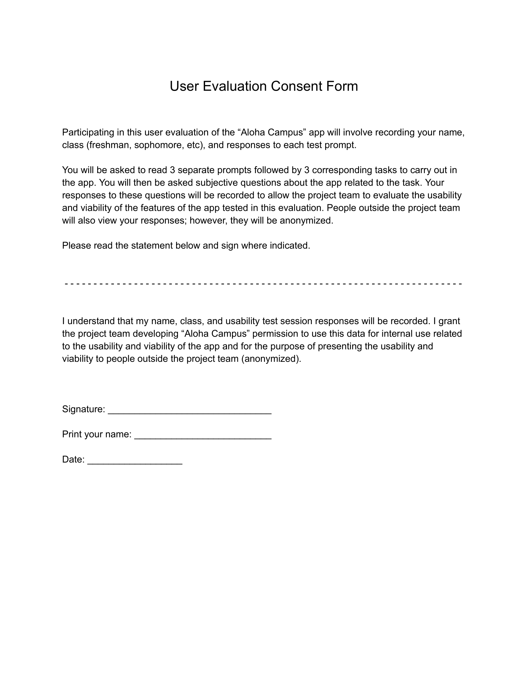

# "Aloha Campus" Usability Evaluation Design

## User Goals

- The user is able to explore how they would find and join a group on campus that they find interesting, and doing this in reality would make them feel more connected to campus life.
- The user is able to explore how they would find people they recognize in their classes, and doing this in reality would make it easier for the user to form connections with other students.
- The user is able to easily form a new public group, making campus life more lively and accessible.

## Scenarios

### Scenario 1

*Prompt*
Imagine you are a student new to campus and want to find groups to join on campus. You decide to register for the "Aloha Campus" app.

*Task*
In the app, find a group that you might find interesting. If none interest you, try finding a group that someone you know might enjoy. View its details and join the group. Then, consider if this feature makes you feel more connected to campus life at UHM. 

*Successful Behavior*
Successful behavior would include the user either using the explore page or search feature to find new groups to join and viewing at least one group page before successfully joining a new group. By doing so, the user feels that they are more connected to campus life.

### Scenario 2

*Prompt*
Imagine are a student that needs to find a group member for two different classes (ICS 691D and ICS 613). It is only the second week of school and you can't remember all of the people in your classes.

*Task*
In the app, scroll through the classes of the test user and find someone that is taking both ICS 691D and ICS 613. Then, consider if this feature would make it easier for you to form connections with other students?

*Successful Behavior*
Successful behavior involves successfully viewing and browsing the test user's classes and viewing and browsing multiple other profiles of people reached from viewing the enrolment of the test user's classes. By doing so, the user finds someone to theoretically form a group with and finds it easier, in general, to form connections on campus by using the app.

### Scenario 3

*Prompt*
Imagine you are the leader of a newly founded finance club in Shidler that is looking to recruit freshman and sophomores. The club is called "Future Finance Pros", and members get access to talks with industry professionals and resume/interview guidance. Next month, you are having your first in person meet and greet.

*Task*
In the app, create a new group for your finance club. Input all the relevant details and make sure it is publicly visible after creating the club. Then, consider if you believe it will be easier to recruit underclassmen for your finance club by using the app. Do you think this feature makes campus life more lively and accessible?

*Successful Behavior*
Successful behavior includes successfully creating the group and adding all necessary details in the appropriate areas. By doing so, the user believes it will be easier to spread information about the group and recruit underclassmen to join. Furthermore, the user thinks that using this feature in the app makes campus life more lively and accessible.

## User Types

There is only one user type:

 - Student: any student at UH Manoa with an @hawaii.edu email address.
   - Freshman and first semester transfer students are of particular special interest, since they are new to campus.
   - Juniors and Seniors that have been at UH for many years can also provide insight into how this might have changed their experience at UH.

## Recruitment

I have personally recruited 3 freshman and 1 transfer students at UH that will participate in the user evaluation. I have also recruited 2 additional upperclassmen (1 junior and 1 senior) that have attended UH for at least 4 semesters each. I have a personal connection to all participants through my involvement in UH Athletics.

The recruitment process involved the project team asking potential users face-to-face if they would be willing to participate in the evaluation until enough participants were gathered. As well, only iPhone users were recruited, since the app is only deployed on Apple's Test Flight.

Their is no incentive, monetary or otherwise, offered to users in this evaluation.

## Consent

See the following preview of the [consent form](https://docs.google.com/document/d/1IhVHFWE9GJV9OJCcrxq6k4La76cOnQkqunWAXaPSMvo/edit?usp=sharing) signed by each participant in the evaluation. Consent was obtained from all participants and a hard copy of the signed consent form for each participant has been collected by the team.

## Participant Description

An anonymized description of each participant is as follows. The total population of users in this evaluation is 6, including 3 freshman, 1 transfer, 1 junior, and 1 senior. They are encoded by A-F.

### Participant A:

- Class: Freshman
- School: UH Manoa

### Participant B:

- Class: Freshman
- School: UH Manoa

### Participant C:

- Class: Freshman
- School: UH Manoa

### Participant D:

- Class: Transfer
- School: UH Manoa

### Participant E:

- Class: Junior
- School: UH Manoa

### Participant F:

- Class: Senior
- School: UH Manoa

## Description of Setting

The usability evaluation took place in the UH Manoa Swimming & Diving Team room located underneath the spectator stands of the Duke Kahanamoku Aquatic Complex at UH Manoa. On December 4th, 2023, all but one of the participants were gathered at 8:45am to do the user evaluation, which lasted about 30 minutes. One user did the study the previous day on December 3rd at 2pm, and they received the same script as the other participants.

## [Script](script.md)

After collecting each signed evaluation consent form, the script found by clicking the link above was followed during the evaluation.

## Raw Data

This section outlines the raw data, which was directly inputted here during the usability evaluation. For each scenario, each participant's response is shown below.

### Scenario 1:

*Participant A:*
- Response: I didn't find a group that I would actually like, but if I did this definitely makes me feel more connected to campus life. It was easy to join a group, but also, I might want to see who is in a group before I join.
- Device Used: their own device

*Participant B:*
- Response: The details provided were helpful, and the joining process was straightforward. Joining such groups on app would definitley add a sense of community and make me feel more engaged with campus life. Coming here at first, I felt like I really needed to put myself out there to find people to do stuff with on campus. This app would help with that.
- Device Used: their own device

*Participant C:*
- Response: I would use this app if it had really campus groups on it, but it seems kinda useless without actually people using it. But, if a bunch of people used this app, it would've helped me connect with campus activities and make me more involved in campus life.
- Device Used: their own device

*Participant D:*
- Response: The details in the group pages gave helpful info on each group, but I still felt like I was going in blind by joining. There should be more information like who is in the group or a separate instagram page about the group or something. But, I would totally browse this app, even if I didn't like any of the groups, just to see whats out there.
- Device Used: their own device

*Participant E:*
- Response: This is something I probably would've used when I first got here, but I would also look at every now and then even after being here a while. If this were real, it would not only connect me with students who share my interests but also provide me opportunities for collaboration and networking. The feature would enhance my sense of belonging and involvement in campus life, even as an upperclassman.
- Device Used: their own device

*Participant F:*
- Response: I want to be able to click on the "upcoming events" box to see a more complete schedule. I want to see announcements/highlights/results in the group page for that group. Once you're "in" the group, I want some contact info to get more involved. And yes, this feature makes me feel more connected to campus life in general.
- Device Used: their own device

### Scenario 2:

*Participant A:*
- Response: It doesn't seem like the app is meant to be used this way, I am just scrolling and clicking to find someone in both classes. If this is actually something you want to do in the app, then you should put in a way to search all students and filter by classes, so you select a couple classes and then see who is in both really easily instead of just searching manually. But, I still think this is way easier than trying to use Laulima to do the same thing. I'm not sure if I would do this in the app though, I think I would want a different group in different classes anyways, and I would just ask someone in person in the class.
- Device Used: their own device

*Participant B:*
- Response: This feature streamlined the process of finding relevant classmates, if I could actually message someone in the app, it would be perfect. Also, you could put in group messages for classes, kinda like discord, but it would automatically add everyone in the class to a class groupchat in the app.
- Device Used: their own device

*Participant C:*
- Response: Trying to find 2 people in the same class got me feeling lost in the app maze. There's no clear way to find the right person. You just end up doing trial and error over and over. You need to add a better search filter for doing this, cause I would use that, but this is too time consuming.
- Device Used: their own device

*Participant D:*
- Response: Yeah this was pretty easy, but definitley not perfect. It only took a couple seconds to find someone. This would make my college life a tad less stressful and a lot more social.
- Device Used: their own device

*Participant E:*
- Response: I did the task, but it wasn't very fun. I felt like I was doing school work trying to find someone, why not make it easier to filter students to find people easier, like search by class or even other stuff like the interests, not just by name.
- Device Used: their own device

*Participant F:*
- Response: Yes, I think being able to find other students taking the same classes as me makes it easier to form connections. Maybe adding a status bar like "looking for a group member in ICS 613", and adding other contact info in the profile page like email or phone.
- Device Used: their own device

### Scenario 3:

*Participant A:*
- Response: Alright, so I made the group easily and put in all the info. I would wanna actually join this group in real life. I might not be creating groups, but I like that other student's can and then I can see that. It would make it so that more stuff is happening on campus and people can start new things more easily.
- Device Used: their own device

*Participant B:*
- Response: Typing in the details to make the group felt like I wasn't using a quality app, I can't really tell why though, also I couldn't get out of the typing thing to click create. But, I love this idea, it makes it really easy for students to get involved in campus.
- Device Used: their own device

*Participant C:*
- Response: I think this would be a useful feature, but only for some students, it might end up getting abused and you just have a bunhc of bogus and inappropriate content, you should add some kind of moderation feature, or maybe make people "request" to create groups that then get inspected before being made public. All in all, its a good idea though and yes it would make it easier to recruit people and make campus life more lively.
- Device Used: their own device

*Participant D:*
- Response: I think this would be more used by people who have been here a while or even professors and other faculty. Maybe you should let teachers make groups too. Yes, it would make campus life more lively, because people would feel more responsible for whats going on at the university.
- Device Used: their own device

*Participant E:*
- Response: Setting up a group was clunky, I couldn't get out of the upcoming events box to click create. But I like the idea that anyone can just start something so easily and you would automatically have a potentially huge audience to be able to see the group or thing you started. But also, you should make it more general that a group, cause what if there is just an event that someone wants to put on and its just a one time thing. Do they really need to make a whole group just for one event. Maybe have another thing like "Stuff on campus" and people can create just events, like a bake sale or whatever, that doesn't need a whole group behind it. This would make campus like more lively, yes.
- Device Used: their own device

*Participant F:*
- Response: I can't get out of the text bar unless I first click on the name field, then "done". After making the group, I am a bit confused, it just disappeared. Maybe redirect to the settings page to make it more clear that the group was made. I think using this feature would make it easier to recruit people and it definitely makes campus life more lively and enjoyable. More broadly, maybe when setting up your profile, you can put in 'interests' and if a new group is made that matches your interests you will get notified about it and/or you can 'subscribe' to a group of individuals with similar interests. Also, unrelated to this feature, but adding other social media like instagram or linkedIn to your profile page would be cool. Also, maybe less green in the app, like make the background a creamy white, it would still be "UH" themed, but not overwhelmingly green.
- Device Used: their own device

## Results

Generally, the user goals were accomplished, but this should be taken with a grain of salt, because test users envisioned a finalized version of the app when stating whether they thought the feature accomplished its related goal.

This section identifies the top 3 usability/viability issues that the evaluation revealed. Issues have been created on the app's project board dedicated to solving these top issues.

### [Exit Mobile Keyboard](https://github.com/UHM-Social-Software/app/issues/51)

When creating a group, users could not remove the mobile keyboard that appears when typing on an iPhone. There needs to be a way to exit that mode in order to reveal the create button. Or move the create button so that it is clickable while the keyboard is still up.

### [More Group/Student Information](https://github.com/UHM-Social-Software/app/issues/52)

A group's page and student's profile pages should include contact information and other social media links. Many users found that the information displayed was not enough to decide if they liked a group or not. 

### [Display publicly a group's membership](https://github.com/UHM-Social-Software/app/issues/53)

More than 1 person said they wanted to see who was in a group before joining, this would be a simple feature to add.

### [Filter student search](https://github.com/UHM-Social-Software/app/issues/54)

When searching for students, add filters to refine the search (class, interests, etc). Many people thought the second task could be tedious if lots of people used the app.