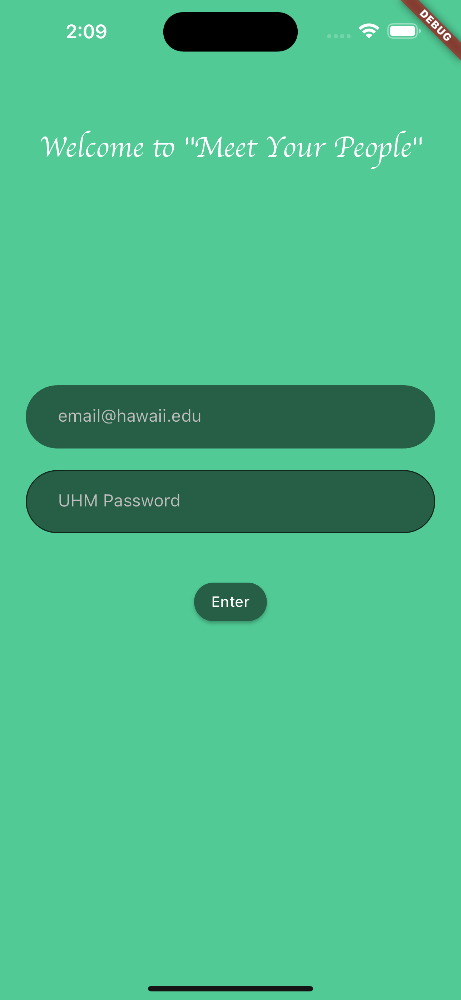
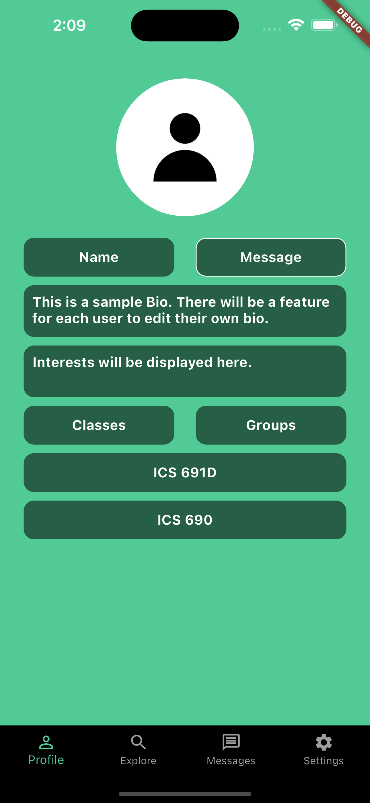
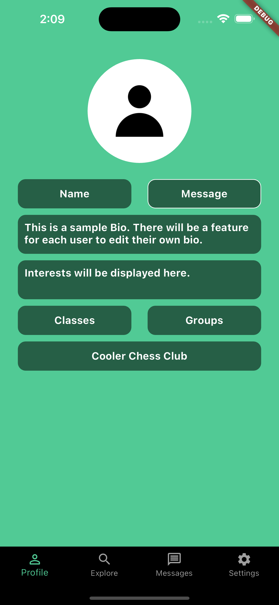
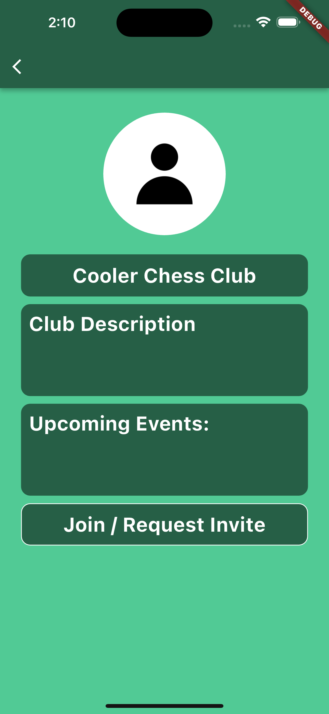
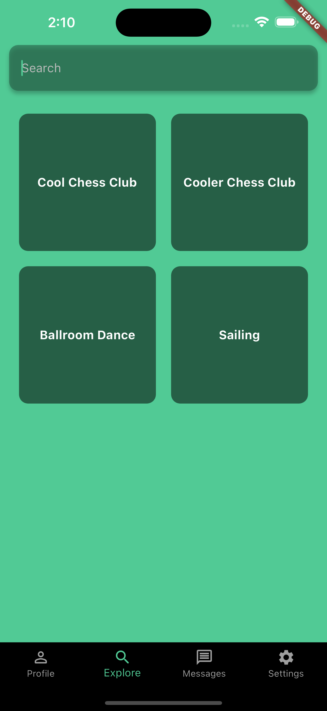
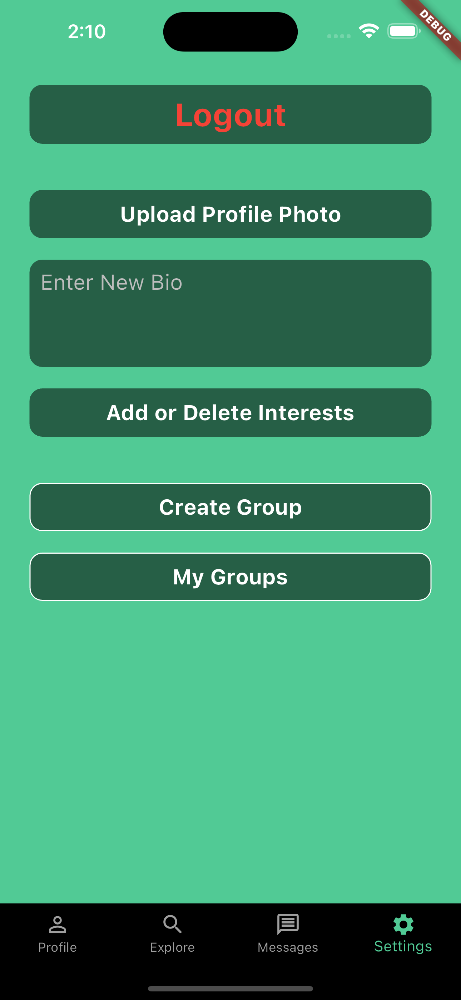
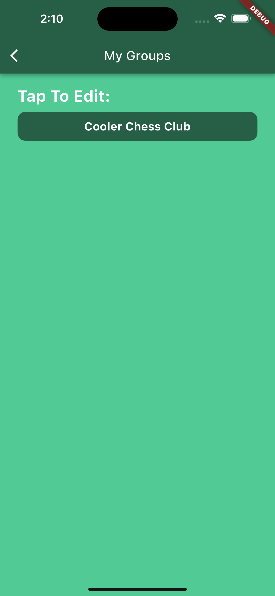
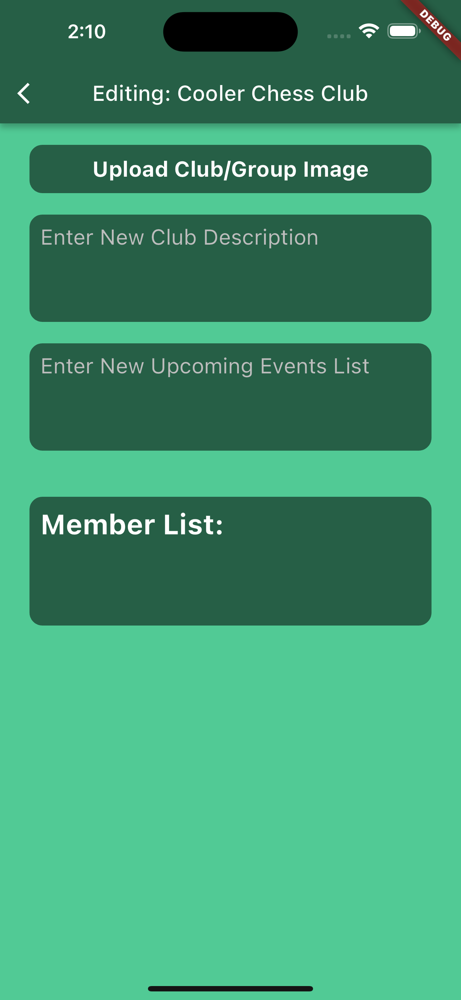

# "Meet Your People" App

## Motivation
The University of Hawaii is lacking a student body directory for making connections on campus.

### The Problem
The University of Hawaii at Manoa has a very diverse student body, with incoming freshman and transfers coming from all over the US and other countries. Combined with many online and hybrid class formats, it can be incredibly difficult for new and current students to meet others in their class or on campus. The only current system implemented to help classmates get in contact with each other is an email list via Laulima; however, names and images are not associated with these emails, and the addresses themselves are often not representative of a students name very well–making the task of contacting someone specific very challenging. Furthermore, there is no central directory for campus clubs or groups. All of these factors that hinder student body connections need to be addressed.

## Goal
The goal of this organization is to implement an app that is easy to use, promotes on campus connections, and increases the quality of the student experience at UH Manoa.

The "Meet Your People" app will allow students to post what classes they are taking, other campus groups/clubs they are part of, and what their interests are. Students will be able to search and explore for groups/clubs (to explore their interests), classes (to see who’s taking a specific class), or a students (to see what classes/groups someone is in and what their interests are). Students will also be able to message other students directly in the app, making it extremely easy to connect with other's in your class or in a group you may want to join.

By making connections on campus more easily, forming study groups, finding new friends, and seeking advice from others that are taking or have taken your class would be more accessible.

##Usage
## User Guide

When you first open the app, you are asked to sign in using your @hawaii.edu login information:


 
After signing in, you are directed to your profile page, showing your currently enrolled classes or groups (depending on which button is clicked):




Clicking on a class displays the students in that class:


Clicking on a group displays information related to that group:



Navigating using the bottom navigation bar reveals the explore, messages, and settings pages. The explore page initially shows all groups created using the app, but the search feature (not currently implemented) will be able to search groups, students, and classes:



The Messages page is not currently implemented, however the settings pages allows students to edit their profile information:



On this page, there are links to create groups or view groups that you have created:





## About Us

[Justin Lisoway](https://justinlisoway.github.io/) - Graduate student at the University of Hawaiʻi at Mānoa studying Information and Computer Sciences. Graduated UHM with MS and BBA in finance.

## Developer Guide
When you first log in as a developer you are also greeted with a landing page and given access to all basic user actions. But as developer you are now given access to the functionalities of add project,


.. Add plant


and add forum


## Community Feedback
**Amanda Mass** - Website serves purpose to show case community projects as well as instant plant info. Could utilize a filter button as well as search bar. Sifting/scrolling for information is inconvenient. Likes logo, thinks logo is cute/inviting. Forum needs a rework. 

**Alie Wolpo** - Look and feel of the forum page definetely needs improvement. Noticed bug where you are allowed to delete your own user as an admin. Likes the look of the plant and project cards. Would be easier to view projects and or plants based on filters instead of raw searching names.

**Ian Hill** - Does not know what the website is about upon entering landing page. Change landing page to give more information on the website. Make plant page more accessible on the landing page. For user homepage implement a limit of projects showcased, possibly click on project card to receive more info on project. Create pagination for forums as well. Scrolling through the forums page is awkward and feels empty.

**Isabelle Camann** - "I like the overall idea of the site, but I think it can be difficult to find projects that I'm interested in if I don't already know the name. Ie: the project labels are not very useful, because there is no way to filter or search based on them."

**Kyle Aldover** - "There are some inconsistent design elements, most pages have a white background, while the forums page randomly has a picture. I like the 2 green colors used throughout though. The forums page in general just doesn't look or feel finished."

## Developer Guide

First, install Meteor.

Second, visit the Aloha Plants application github page, and click the “Use this template” button to create your own repository initialized with a copy of this application. Alternatively, you can download the sources as a zip file or make a fork of the repo. However you do it, download a copy of the repo to your local computer.

Third, cd into the aloha-plants/app directory and install libraries with:

```
$ meteor npm install
```

Fourth, run the system with:

```
$ meteor npm run start
```

If all goes well, the application will appear at http://localhost:3000.


## Continuous Integration

Aloha Plants uses GitHub Actions to automatically run ESLint and TestCafe each time a commit is made to the default branch. You can see the results of all recent "workflows" at [https://github.com/tech-for-a-greener-hawaii/aloha-plants/actions](https://github.com/tech-for-a-greener-hawaii/aloha-plants/actions).


## M1
[Milestone 1](https://github.com/orgs/tech-for-a-greener-hawaii/projects/2)

## M2
[Milestone 2](https://github.com/orgs/tech-for-a-greener-hawaii/projects/3/views/2)

## M3
[Milestone 3](https://github.com/orgs/tech-for-a-greener-hawaii/projects/5/views/1)

## [Deployment](https://aloha-plants.online/)
