# "Aloha Campus" App

## Motivation
The University of Hawaii is lacking a student body directory for making connections on campus.

### The Problem
The University of Hawaii at Manoa has a very diverse student body, with incoming freshman and transfers coming from all over the US and other countries. Combined with many online and hybrid class formats, it can be incredibly difficult for new and current students to meet others in their class or on campus. The only current system implemented to help classmates get in contact with each other is an email list via Laulima; however, names and images are not associated with these emails, and the addresses themselves are often not representative of a student's name very well, making the task of contacting someone specific very challenging. Furthermore, there is no central directory for campus clubs or groups. All of these factors that hinder student body connections need to be addressed.

## Goal
The goal of this organization is to implement an app that is easy to use, promotes on campus connections, and increases the quality of the student experience at UH Manoa.

The "Aloha Campus" app will allow students to see other students in the classes they are taking, create and join other campus groups/clubs they are part of, and share other social information such as their interests and bio. Students will be able to search and explore for groups/clubs (to explore their interests), classes (to see who’s taking a specific class), or students (to see what classes/groups someone is in and what their interests are). Students will also be able to message other students directly in the app, making it extremely easy to connect with other's in your class or in a group you may want to join.

By making connections on campus more easily, forming study groups, finding new friends, seeking advice from others that are taking or have taken your class, and any other campus connections will be more accessible.

## Usage

When you first open the app, you are asked to sign in or register:

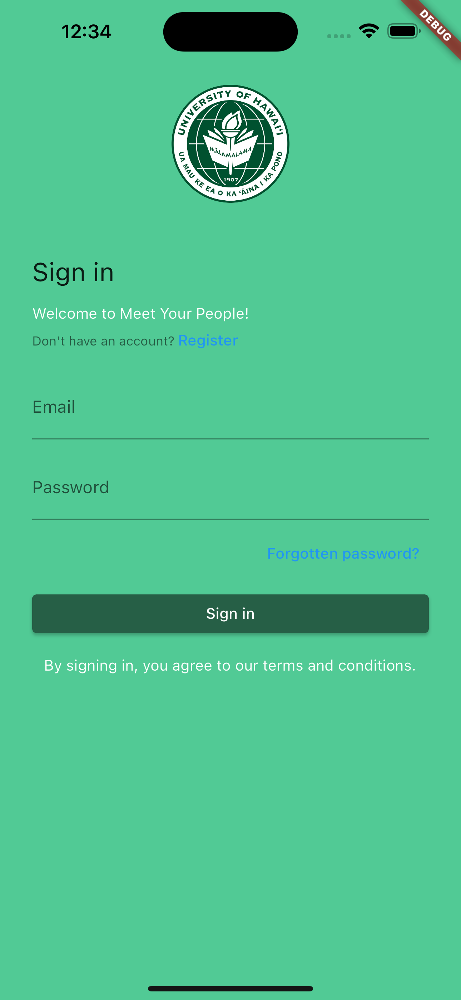
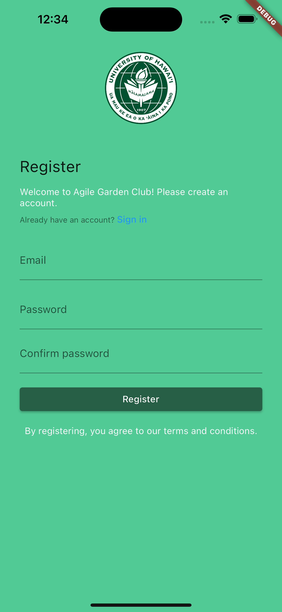

Currently, only valid email/password combinations that are in the database will allow a user to signin. In a finalized version of this app, a user will only be able to sign in with an @hawaii.edu email address. This would allow access to the user's classes, making the app function properly by populating the user's classes in the database.

After signing in, you are directed to your profile page, showing your currently enrolled classes or groups (depending on which button is clicked). The classes, groups, and other information shown here depend on the currently logged in user:

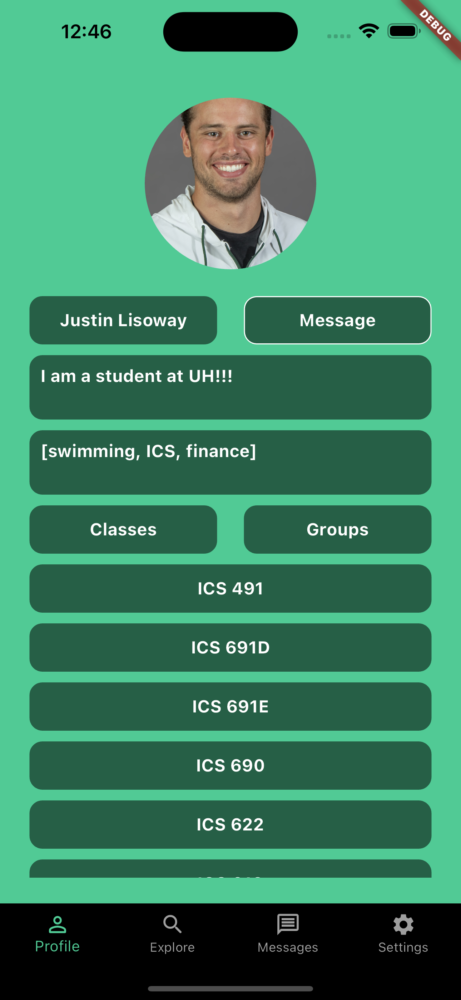
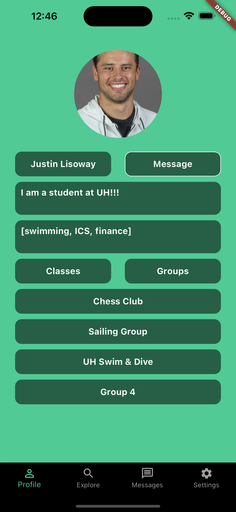

Clicking on a class displays the students in that class:

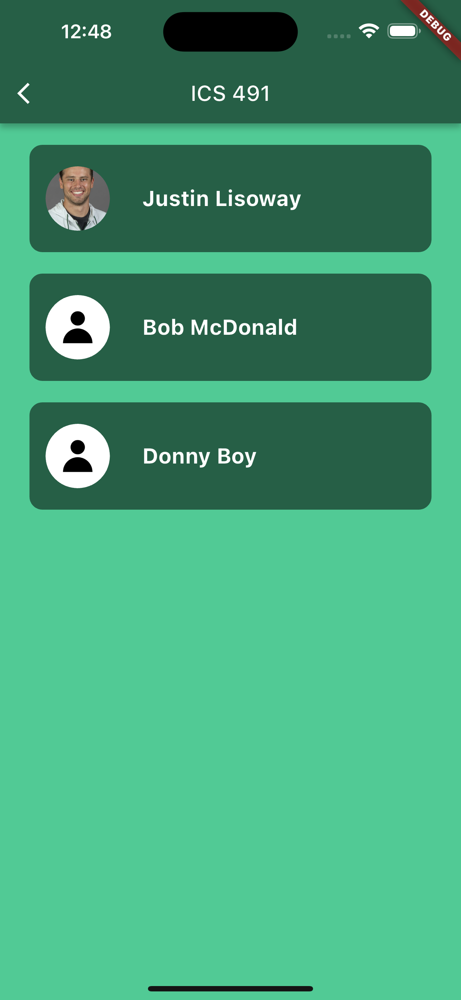

Clicking on a student displays that students profile page:

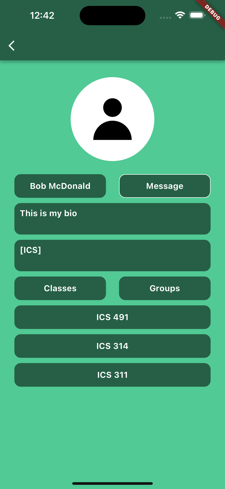

Going back, clicking on a group displays information related to that group:

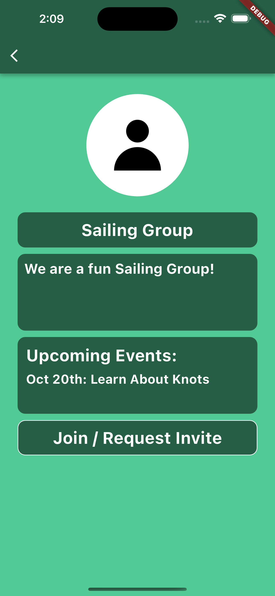

Navigating using the bottom navigation bar reveals the explore, messages, and settings pages. The explore page initially shows all groups created using the app.

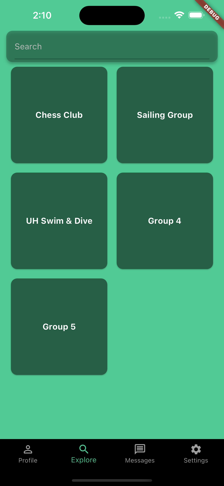

You can also click on groups to view their page and join them, which shows the same group page as above. When the search bar is populated, a page is shown that lists any groups, students, and/or classes that match the search:

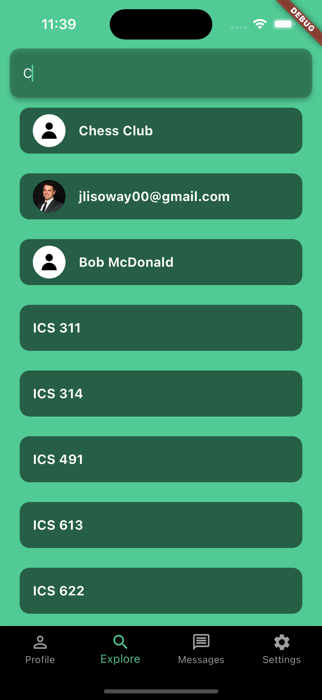

Clicking on any of these results shows the respective group, profile, or class page as shown above.

The Messages tab has a rough layout, but will not be functional in this prototype of the app. In a finalized version, this messaging page would resemble any common app messaging feature with a list of chats containing private messages between the current user and other users:

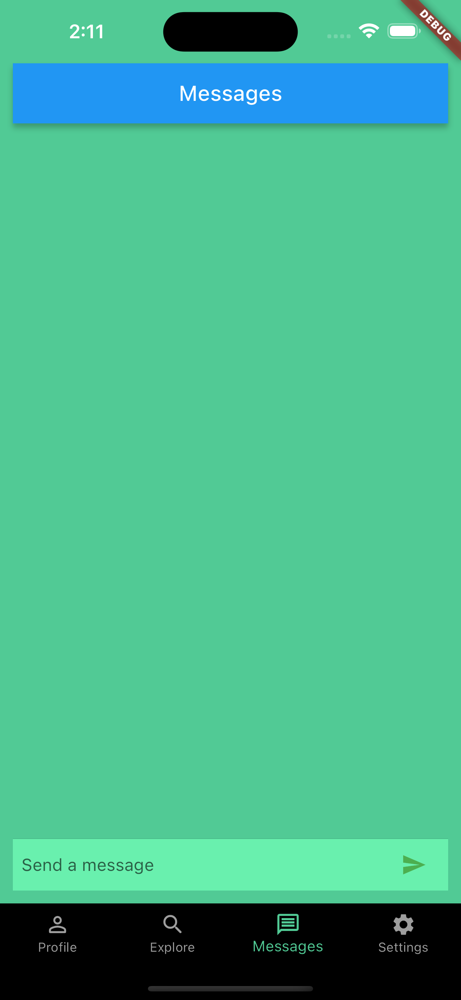

The settings pages allows students to edit their profile information including their image, bio, and interests, or logout (returning the user to the signin page).

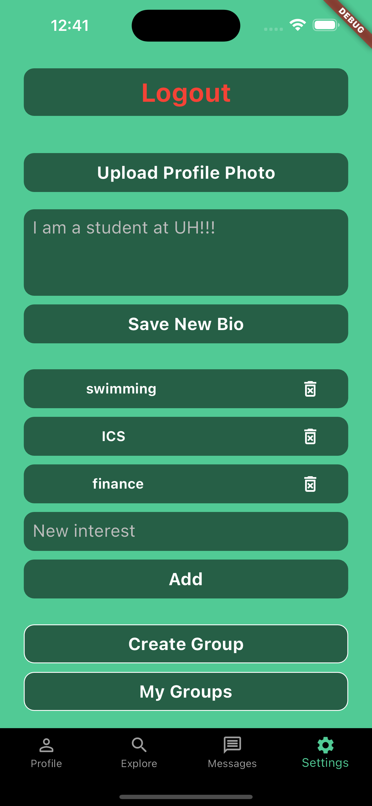

On the settings page, there are also buttons to create new groups or view groups that you are the owner of. Clicking on the 'Create Group' button reveals a page to create a new group:

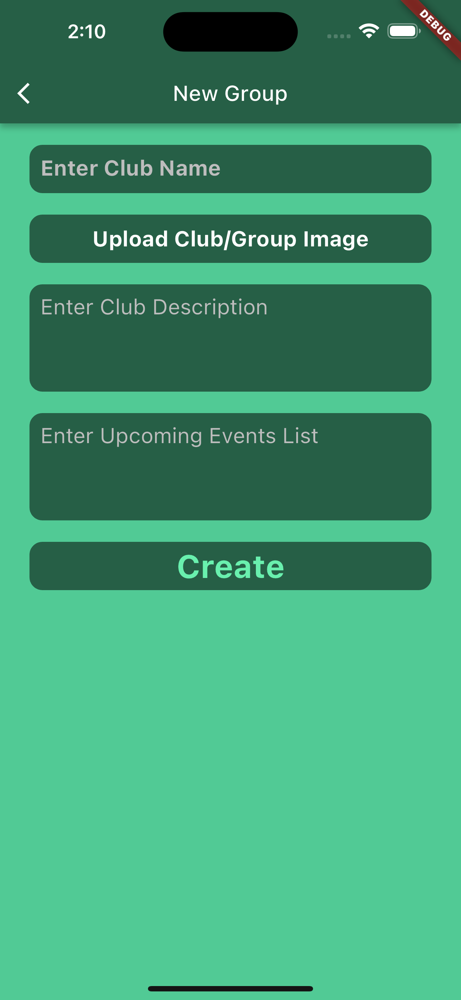

Clicking on the 'My Groups' button reveals a page listing all the groups that you own. Clicking on any of these groups reveals a page allowing you to edit group information including the image, description, upcoming events, and member list (delete members only).

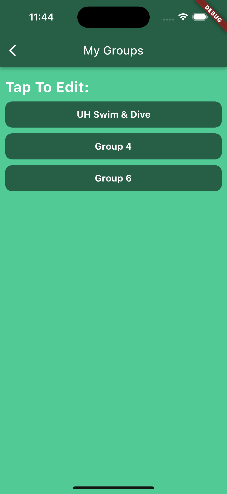

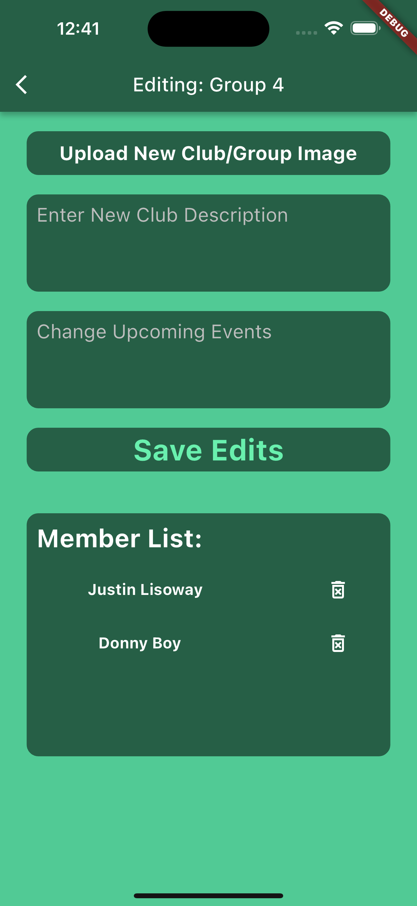

Everything in this version of the app is connected to a Firestore backend database. Authentication is also provided by Firebase. This version of the app is also deployed using Apple Test Flight for initial user evaluation.

## Installation
Phase 1: [Repository](https://github.com/UHM-Social-Software/app/tree/phase-1-mockup)

Phase 2: [Repository](https://github.com/UHM-Social-Software/app/tree/phase-2-mockup)

Phase 3: [Repository](https://github.com/UHM-Social-Software/app/tree/phase-3-mockup)

Phase 4: [Repository](https://github.com/UHM-Social-Software/app/tree/phase-4-app)

Phase 5: [Repository](https://github.com/UHM-Social-Software/app/tree/phase-5-app)

Deployed Version: [Repository](https://github.com/UHM-Social-Software/app/tree/deployment)

To run this code, clone the repository to your local machine and invoke 'flutter run' on the app directory. You may also need to first install flutter and get dependencies by running 'flutter pub get' (this can be done easily with intelliJ). Note: the app is currently mocked-up to look best on the XCODE iOS iPhone 15 simulator; however, flexible widgets should provide functionality on a variety of screen sizes.

### Testing Credentials
Username: jlisoway@hawaii.edu
Password: asdfasdf

## [Development status](https://github.com/orgs/UHM-Social-Software/projects/1)

The Deployed App is now complete. The app currently has the most important features implemented and connected to a Firestore backend database, including functional user authentication. User Evaluation is currently underway, which will include sending the app to test users via Apple's Test Flight.

## [Evaluation](evaluation.md)

The goals and progress of the App's evaluation is summarized in the evaluation page. Click the link above to view.

## About The Team

[Justin Lisoway](https://justinlisoway.github.io/) - Graduate student at the University of Hawaiʻi at Mānoa studying Information and Computer Sciences. Graduated UH Manoa with an MS and BBA in finance.
